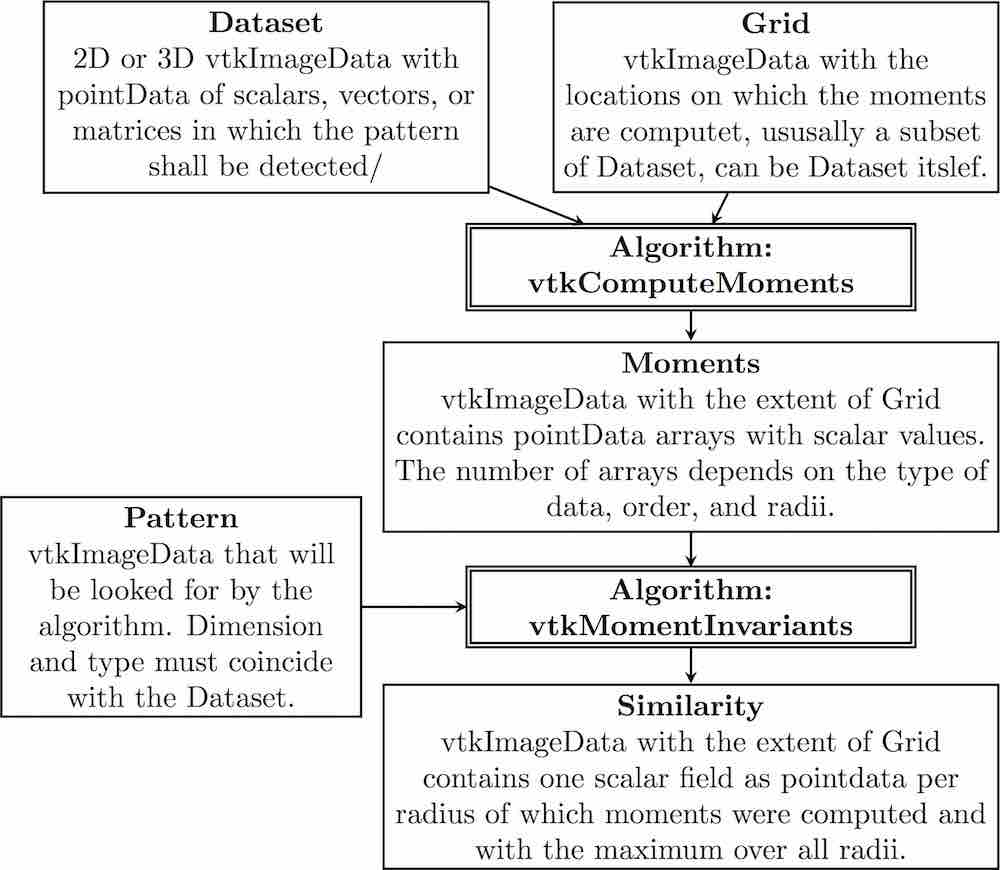
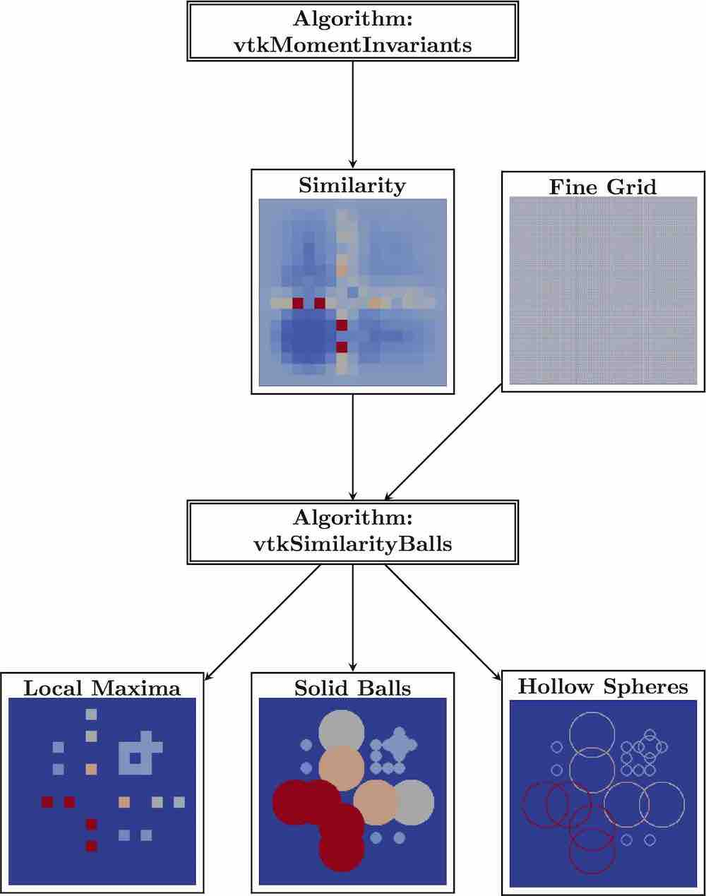
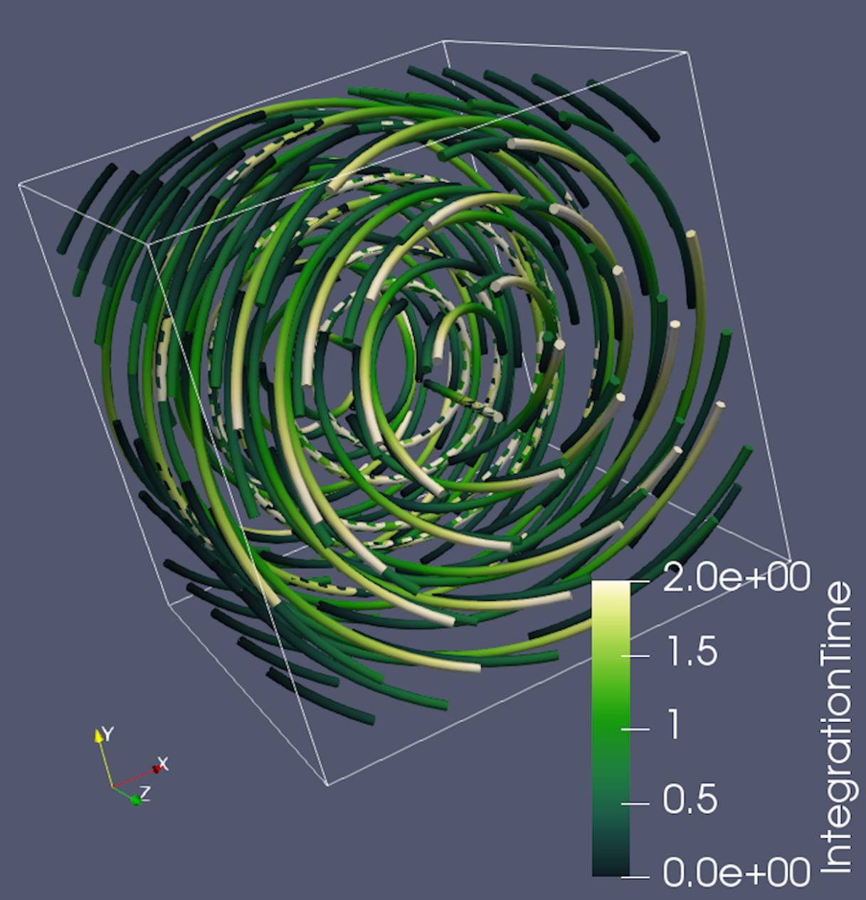
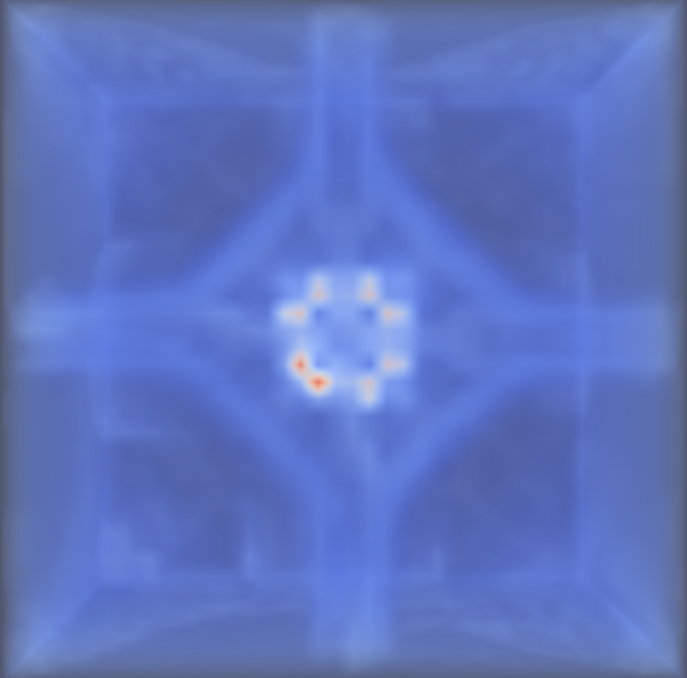
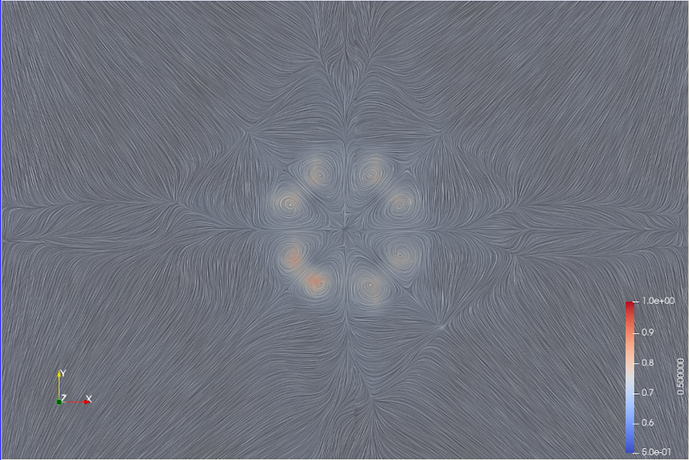
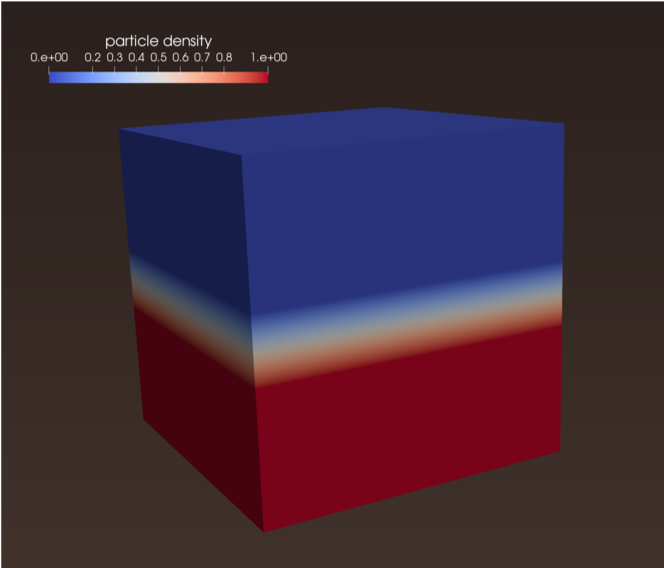
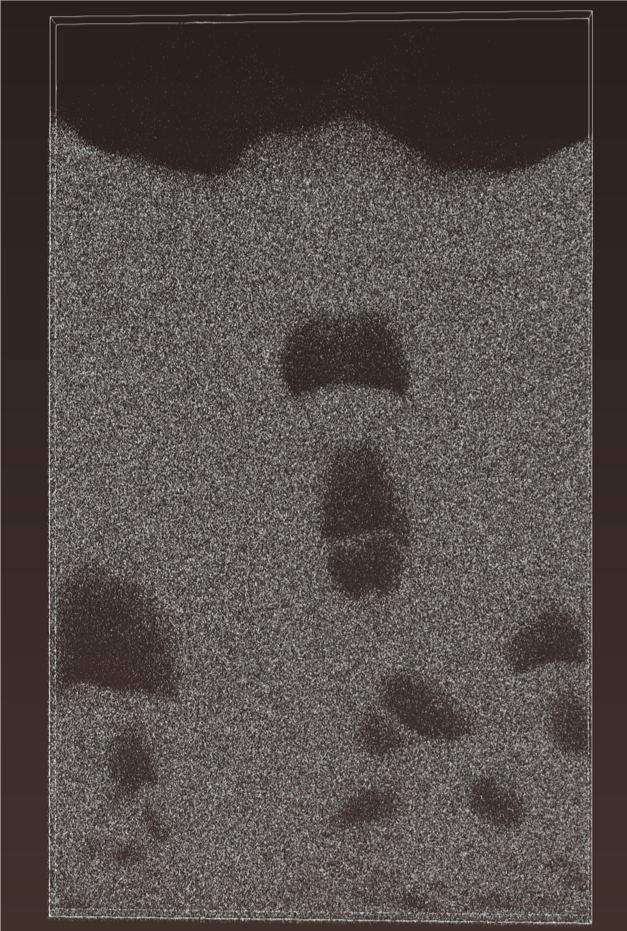
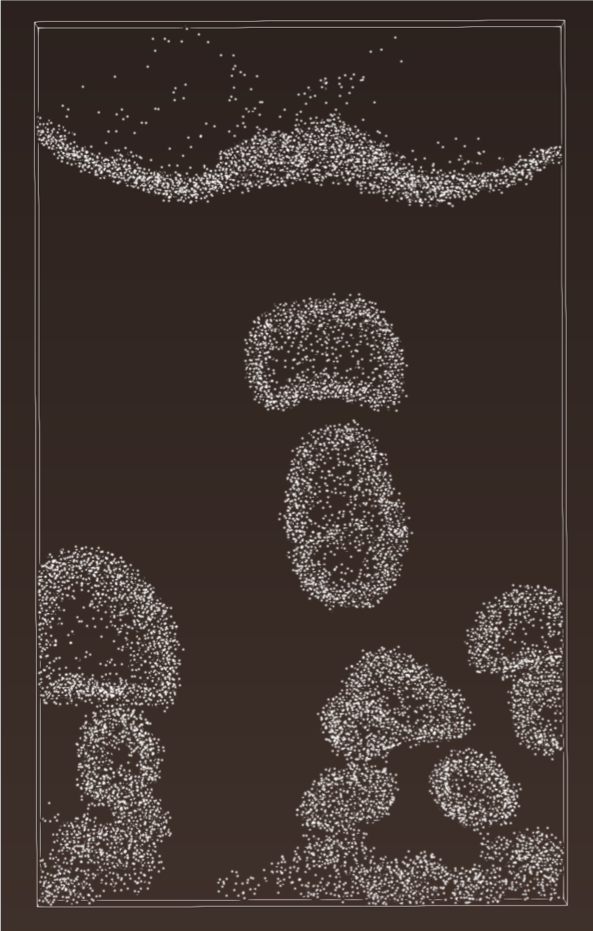

.. _label_moments:

Rotation Invariant Pattern Detection
====================================

Overview
^^^^^^^^

Pattern detection can be used to identify known features in a simulation in situ to reduce the amount of data needing to be written to disk.  For simulations where physically meaningful patterns are already known, the orientation of the pattern may not be known a priori.  Pattern detection can be unnecessarily slowed if the pattern detection algorithm must search for all possible rotated copies of a pattern template.  Therefore, rotation invariance is a critical requirement.  Moment invariants can achieve rotation invariance without the need for point to point correlations, which are difficult to generate in smooth fields. For an introduction to moment invariants, we recommend:

*Flusser, J., Suk, T., & Zitová, B. (2016). 2D and 3D Image Analysis by Moments. John Wiley & Sons*.

ALPINE has implemented two VTK filters that together are able to perform rotation invariant pattern detection. The algorithm upon which the moment invariants pattern detection is based can be found in:

*Bujack, R., & Hagen, H. (2017). Moment Invariants for Multi-Dimensional Data. In Modeling, Analysis, and Visualization of Anisotropy (pp. 43-64). Springer, Cham*.

Algorithm Description
^^^^^^^^^^^^^^^^^^^^^

The input to pattern detection algorithm consists of three pieces which must match in data type and dimensionality:

  1) A 2D or 3D vtkImageData dataset of scalars, vectors, or matrices which will be searched for:
  2) A vtkImageData pattern
  3) A vtkImageData grid that defines the subset of (1) that is searched for the pattern; note that this may be the full dataset.

The first VTK filter, **vtkComputeMments** computes the moments while the second filter, **vtkMomentsInvariants**, performs the normalization based on the given pattern and computes the similarity.  The architecture of the filter, with inputs and outputs, can be found in the following figure.

Extensions
----------

The **MomentInvariants** module contains several extra algorithms and helper classes.

.. code-block:: text

 vtkMomentsHelper : a class that provides functions for the moments computation that
                    will be needed by vtkComputeMoments and vtkMomentInvariants.

.. code-block:: text

 vtkMomentsTensor : a class that provides the functionality to treat tensors of arbitrary
                    dimension and rank.  It supports addition, outer product,
                    and contractions.

.. code-block:: text

  vtkSimilarityBalls : a filter that takes the similarity field produced by
                       vtkMomentInvariants and computes the local maxima in
                       space plus scale and produces the output
                       localMaxSimilarity that contains the similarity value
                       together with the corresponding radius at the maxima.
                       All other points are zero.

For further visualization, **vtkSimilarityBalls** also produces two output fields that encode the radius through drawing a solid ball or a hollow sphere around those locations.
The second input, i.e. the grid, steers the resolution of the balls. It is helpful if its extent is a multiple of the first input's. Then, the circles are centered nicely.
The spheres/circles are useful for 2D visualizations, as they can be laid over a visualization of the field.  The balls are good for 3D volume rendering or steering of the seeding of visualization elements.

The 2D visualzation is described in:

*Bujack, R., Hotz, I., Scheuermann, G., & Hitzer, E. (2015). Moment invariants for 2D flow fields via normalization in detail. IEEE transactions on visualization and computer graphics, 21(8), 916-929*

and the 3D counterpart in:

*Bujack, R., Kasten, J., Hotz, I., Scheuermann, G., & Hitzer, E. (2015, April). Moment invariants for 3D flow fields via normalization. In Visualization Symposium (PacificVis), 2015 IEEE Pacific (pp. 9-16). IEEE*.

A schematic overview of the use of **vtkSimilarityBalls** with example images is given in the following Figure.

.. code-block:: text

  vtkReconstructFromMoments : a filter that takes the momentData, as produced by
                              vtkComputeMoments or vtkMomentInvariants, and a grid.
                              It reconstructs the function from the moments (similar to
                              reconstructing a function from the coefficients of a Taylor
                              series).  For the reconstruction, we first orthonormalize the
                              moments. Then, we multiply the coefficients with their
                              corresponding basis function and add them up.

..
  There are three applications for this function.  First, given the moments of the pattern and the grid of the pattern, we can see which parts of the template the algorithm can actually grasp with a given order during the pattern detection.  The following figure shows images created using moments up to second order.

..
  .. image:: Moments/momentsChartReconstructPattern.jpg
      :align: center
      :width: 95%

..
  Second, if we put in the normalized moments of the pattern and the grid of the pattern, we can see the standard position. There might be several standard positions due to the ambiguity of the eigenvectors that differ by rotations of 180 degree and possibly a reflection. The algorithm will use the first one. In the previous Figure, the reflection along the x-axis would also be a standard position.

..
  Third, if we put in the moments of the field and the original field data, we can see how well the subset of points, on which the moments were computed, actually represents the field. The following Figure depicts an example using a 16 x 16 coarse grid and moments up to second order.

..
  .. image:: Moments/momentsChartReconstructField.jpg
      :align: center
      :width: 95%

Use Case Example - paraview-vis.py
^^^^^^^^^^^^^^^^^^^^^^^^^^^^^^^^^^

The pattern detection algorithm can be demonstrated using ALPINE's `Ascent`_ infrastructure and its built-in example integration, the Cloverleaf3D proxy application (http://uk-mac.github.io/CloverLeaf3D/).

In this case, the ascent_actions.json (below) points to a python script, paraview-vis.py that describes the visualization:

.. code-block:: JSON

  [
    {
      "action": "add_extracts",
      "extracts":
      {
        "e1":
        {
          "type": "python",
          "params":
          {
            "file": "paraview-vis.py"
            }
          }
        }
    },

    {
      "action": "execute"
    },

    {
     "action": "reset"
    }
  ]

An example python script and pattern can be found in: Instructions for In Situ ParaView Vis using Ascent Extract Interface https://github.com/danlipsa/ascent/tree/moment-invariants/src/examples/paraview-vis.

.. code-block:: text

   paraview-vis-cloverleaf3d-momentinvariants.py : example script calling the moments invariant
                                                   algorithm; make a symbolic link pointing
                                                   paraview-vis.py to this script.

   expandingVortex.vti : example vtkImageData pattern for CloverLeaf3D

The pattern detection workflow was run in Ascent through ParaView. The images show the output of the algorithm for a vortex pattern for a single timestep of Cloverleaf running in parallel. On the left, we show the pattern visualized through streamlines. In the center, the 3D similarity output is volume rendered with red corresponding to high similarity to the pattern. On the right, we put a slice with line integral convolution (LIC) through the 3D data at the location of the strongest matches to verify the result.

Use Case Example - Bubble-finding
^^^^^^^^^^^^^^^^^^^^^^^^^^^^^^^^^

One example of using rotational invariant pattern detection is for data reduction in an `MFIX-Exa`_ bubbling bed simulation.  The pattern that is used for the search is a simple density boundary -- particles on one side, no particles on the other (left-hand image).   The middle image shows the original dataset while the right-hand image shows the bubbles found by the rotational invariant pattern detection algorithm saving only 5% of the original data.

Repository Information
^^^^^^^^^^^^^^^^^^^^^^

The moment invariants pattern detection code is found within the Kitware GitLab:

VTK: https://gitlab.kitware.com/vtk/vtk (dc2d04cdd3167d0a0aa95bc3efffa13f26c98516)

MomentInvariants: https://gitlab.kitware.com/vtk/MomentInvariants (df81d17f941989d9becdbcf10413e53af7a7ab10)
Includes unit testing instructions.  

Instructions for In Situ ParaView Vis using Ascent Extract Interface: https://github.com/danlipsa/ascent/tree/moment-invariants/src/examples/paraview-vis

The moment invariant pattern detection algorithm was developed by Roxana Bujack and Karen Tsai at Los Alamos National Laboratory and Dan Lipsa at Kitware, Inc.

.. _Ascent : https://alpine-dav.github.io/ascent/
.. _MFIX-Exa : https://mfix.netl.doe.gov/doc/exa/develop/

.. toctree::
   :maxdepth: 1
