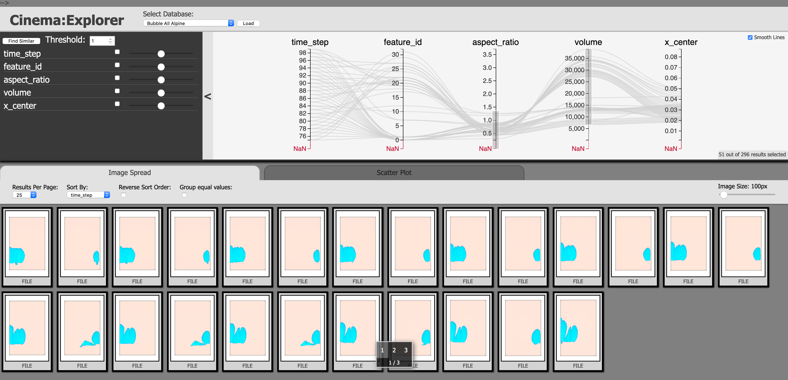
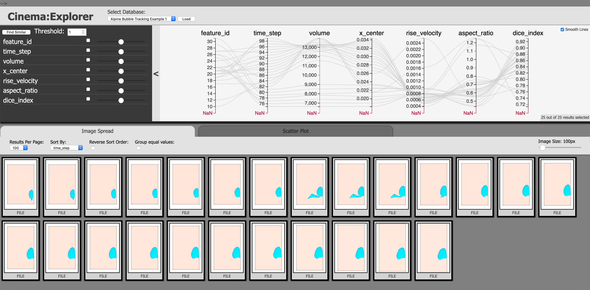
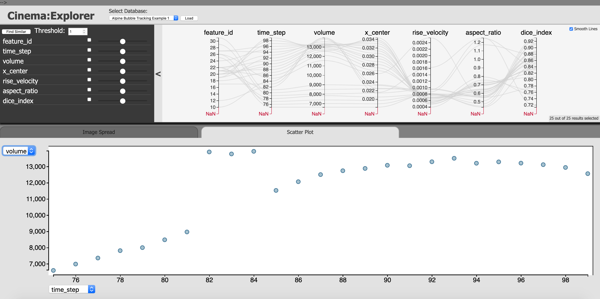
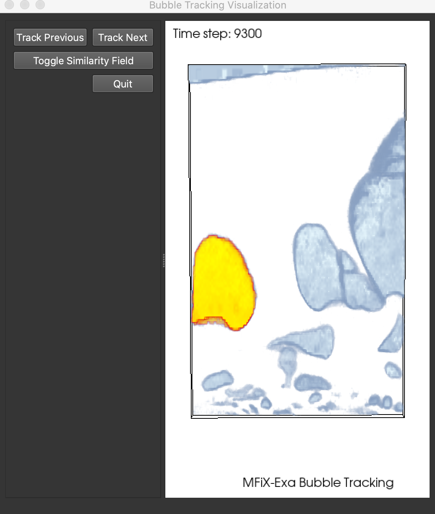
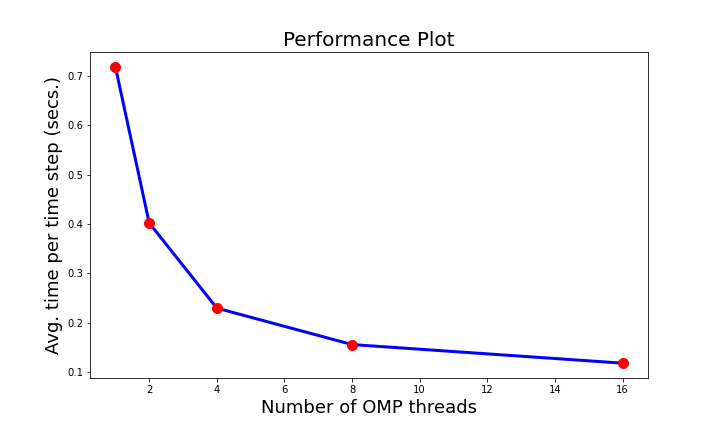

.. _label_stat_feature_detect:

In Situ Statistical Feature Detection and Post Hoc Tracking Algorithm
=====================================================================

Overview
^^^^^^^^

In Situ Statistical Feature Detection Algorithm
###############################################

The Statistical feature detection algorithm is an in situ feature detection algorithm that processes three-dimensional (3D) particle fields in situ and transforms the data into a feature similarity field, which is stored in the disks for further post hoc analysis. Even though our current version of the algorithm works on a particle field, the algorithm can be easily applied to any regular-grid scalar data with minor modifications. By analyzing data in situ and detecting user-interested feature regions, the algorithm outputs a statistically summarized data set, which is significantly smaller in size compared to the raw particle data and such summarized data can be analyzed interactively in post hoc analysis for further feature analysis. This algorithm follows the feature-driven data reduction paradigm to achieve significant data reduction while preserving important information so that post hoc analysis can be done on the reduced data promptly.

This algorithm works on an unstructured particle field and a feature is represented as a statistical probability distribution. Representing the feature in the form of distribution allows the application scientists to specify a descriptor of the features of interest without needing to precisely define it. In many application domains, a precise description of a feature is not readily available due to the complexity of the scientific data and so a statistical technique such as this is a promising solution for feature detection. An interactive user interface can be used where the users can move a cube object freely inside the data and put it in a region where they are interested. Next, a distribution representation (currently Gaussian distribution is used, but any other distribution model can be used) is created from the data points within that selected cube region and is used as the target feature descriptor that we want to find in the data. For our current target application, the algorithm takes a particle field as input and first transforms it into a regular grid particle density field, which is a scalar field and is used as an intermediate representation. Then the density field is passed through a 3D super voxel generating algorithm, called Simple Linear Iterative Clustering (SLIC) [2], that produces super voxels from the particle density field. Now, a (Gaussian) distribution is modeled for each super voxel using the density values from respective super voxels. Finally, we use a distribution similarity measure to compute the statistical similarity between each super voxel distribution and the user-provided target feature distribution. Using these distribution similarity values for each super voxel, the algorithm finally generates a new feature similarity scalar field where each data point in the regular grid indicates its similarity with the user-given target feature. This feature similarity field is stored into disks at each time step for further detailed interactive post hoc analysis. A detailed version of this algorithm can be found in [1].

This statistical feature detection algorithm is made available as a VTK-based  ParaView/Catalyst filter for the user community. We have also developed a VTKm-based filter of this algorithm, which will be made available soon and the VTKm version of the algorithm will be using accelerators to improve computational performance.

Post Hoc Feature Tracking Algorithm 
####################################

To enable post hoc analysis of the in situ detected features, we have developed a Python-based feature tracking algorithm. This algorithm allows extraction and tracking of user-interested features so that the temporal feature dynamics can be studied in detail. The feature tracking algorithm takes the in situ generated feature similarity fields as input and then can track a user-specified feature throughout its lifetime. The tracking algorithm also detects merge and split events for the target feature so that the interactivity of the features can be studied. The analysis results are visualized in the form of a Cinema database [3] and use an interactive CinemaExplorer interface. Also, we have developed a VTK-based visualization tool that allows visual analysis of tracking results directly in 3D space.

To solve the correct correspondence between features in consecutive time steps, we use an overlap-based testing method. First, the features are segmented using a suitable feature similarity threshold, and then a connected component algorithm is applied so that each segment gets a unique feature id assigned to it. Next, given a target feature, our algorithm tracks it through space and time as long as the feature lasts within the simulation bound. To estimate the overlap amount, instead of just checking the intersection between objects, we compute the Dice similarity index which gives the amount of intersection between two features. The Dice index is computed directly in 3D space so that the correct overlap is detected. Formally given two sets of points `A` and `B`, their Dice similarity index `DI(A, B)` is measured as: 

:math:`DI(A,B) =  \frac{2\left| A \cap B \right|}{\left| A \right| + \left| B \right|`

The Dice index value can be interpreted as matching confidence and when an abruptly low value is found, such a time step is flagged for further investigation. In our method, we track feature volumes to explore potential merge and split events. During tracking, a sudden rise in the feature volume indicates a merge event while a significant drop in feature would indicate splitting. From the tracking results, we also estimate the feature rise velocity, an important feature characteristic of interest to the domain experts. The feature rise velocity is computed from differences of the centroids of matched features from the consecutive time steps.

Getting Started
^^^^^^^^^^^^^^^

In Situ Statistical Feature Detection Algorithm
###############################################

The statistical distribution-based in situ feature detection algorithm is available as a VTK filter and is deployed in situ through ParaView/Catalyst pipeline. The name of the VTK filter is "vtkPFeatureAnalysis". This filter generates a histogram-based density field from the particle data using distributed data communication. Then SLIC super voxel algorithm is applied to generate the super voxels (clusters) from the particle density field and finally, the statistical similarity field is computed and stored into the disks for post hoc analysis. The output field can be readily visualized in ParaView/VisIT.

This filter expects two input parameters from the users and can be specified in the Catalyst python script:

#. Size of the 3D super voxel/clusters ("ClusterBlockSize") - The expected X, Y, Z size of the super voxels to be generated.
#. Parameters for user-specified target feature distribution ("FeatureGaussian") - Currently takes mean and standard deviation values for the target feature distribution.

Currently, the output dimensions of the feature similarity scalar field are set to `128X16X128`. In our upcoming version, we plan to make it an input parameter.

Post Hoc Feature Tracking Algorithm 
###################################

The feature tracking code currently takes the in situ generated feature similarity fields as input. The script needs to be pointed to the directory that contains such outputs in VTI format. Next, the tracking script also expects a feature id and a time step as input which will indicate which feature to be tracked.
We also provide two separate python scripts. The first script is used to segment all the features from the VTI files and generate new VTI output files where each feature is segmented and isolated for all the time steps. The second script computes the feature attributes such as feature volume, feature mass, etc., for each segmented feature so that they can be visualized and analyzed while exploring the tracking results.

The tracking script also produces a Cinema database output of the tracked feature that contains images of the tracked feature for all the tracked time steps. The images are precomputed using a Python-based script that uses ParaView to produce images of the rendered features.

Example Result - In situ bubble detection and post hoc Tracking in MFIX-Exa simulation
^^^^^^^^^^^^^^^^^^^^^^^^^^^^^^^^^^^^^^^^^^^^^^^^^^^^^^^^^^^^^^^^^^^^^^^^^^^^^^^^^^^^^^^

In Situ Statistical Feature Detection Algorithm
###############################################

The following Fig. 1 shows a representative result of this algorithm when applied on a time step of MFIX-Exa particle field. The step-by-step in situ processing of the algorithm is shown. The final bubble similarity field is stored in the disks for post hoc bubble dynamics analysis.

.. _concept:
.. figure:: FeatureDetect/algorithm_concept.png
      :align: center
      :width: 95%
      :figclass: align-center

      Fig. 1 Steps of the in situ statistical feature detection algorithm.

Post Hoc Feature Tracking Algorithm 
###################################

.. _label1:

      Fig. 2 Cinema database showing all the extracted bubbles with their different attributes using a Parallel Coordinates plot.

To visualize the bubble tracking results and the bubble dynamics, we have developed a Cinema-based post hoc feature tracking visualization workflow that uses a customized CinemaExplorer (https://github.com/cinemascience/cinema_explorer) interface to allow the application experts to explore the tracking results. We first create a Cinema database consisting of all the bubble features. Several bubble attributes such as bubble volume, location, aspect ratio, etc. can be studied to get a general overview of all the bubbles in the simulation data. Fig. 2 shows an example of the CinemaExplorer interface where several bubbles are filtered from the Parallel Coordinates plot (PCP) at the top panel and the filtered bubbles are shown at the bottom.

.. _label2:

      Fig. 3 Cinema database showing tracking result of a single bubble over time.

In Fig. 3, we show bubble tracking results of a specific bubble, tracked both forward and backward in time so that the complete time evolution of the bubble can be explored. After tracking, we compute bubble velocity and Dice similarity index and add them to the bubble tracking attribute list so that users can filter bubbles based on such attributes. We find that the bubbles typically merge/split as they move through space and time. The bubbles generally rise upward in the domain and merge/split events can be visualized using a scatterplot between bubble volume and time. A sudden increase in bubble volume in consecutive time steps would indicate a bubble merge and a sudden decrease in bubble volume would indicate a bubble split. 

.. _label3:

      Fig. 4 A scatterplot between bubble volume (Y-axis) and time steps (X-axis). The bubble suddenly increases from time step 81 to 82 which indicates a bubble merge event has happened.

In Fig. 4 we show a scatterplot using the CinemaExplorer interface (X-axis time steps, Y-axis bubble volume) where we see that at time step 82, the bubble volume increases significantly, indicating a bubble merge event. 

.. _label4:

      Fig. 5 3D bubble tracking visualization.

To investigate the bubble tracking results and bubble shapes directly in the 3D domain, we have also developed a Python and VTK based visualization interface (shown in Fig. 5) where the users can interactively visualize bubble tracking results. Together with the CinemaExplorer and 3D bubble tracking interfaces, the application experts can study the time-varying bubble dynamics flexibly and interactively.

Use Case Example
^^^^^^^^^^^^^^^^
To demonstrate the use of statistical distribution-based feature detection VTK filter, here is an example Python-based Catalyst script file:

.. code-block:: python

  #--------------------------------------------------------------

  # Global timestep output options
  timeStepToStartOutputAt=0
  forceOutputAtFirstCall=False

  # Global screenshot output options
  imageFileNamePadding=0
  rescale_lookuptable=False

  # Whether or not to request specific arrays from the adaptor.
  requestSpecificArrays=False

  # a root directory under which all Catalyst output goes
  rootDirectory=''

  # makes a cinema D index table
  make_cinema_table=False

  #--------------------------------------------------------------
  # Code generated from cpstate.py to create the CoProcessor.
  # paraview version 5.8.1-1-g40b41376db
  #--------------------------------------------------------------

  from paraview.simple import *
  from paraview import coprocessing

  # ----------------------- CoProcessor definition -----------------------

  def CreateCoProcessor():
    def _CreatePipeline(coprocessor, datadescription):
      class Pipeline:
        # state file generated using paraview version 5.8.1-1-g40b41376db

        # ----------------------------------------------------------------
        # setup views used in the visualization
        # ----------------------------------------------------------------

        # trace generated using paraview version 5.8.1-1-g40b41376db

        #### disable automatic camera reset on 'Show'
        paraview.simple._DisableFirstRenderCameraReset()

        # get the material library
        materialLibrary1 = GetMaterialLibrary()

        # Create a new 'Render View'
        renderView1 = CreateView('RenderView')
        renderView1.ViewSize = [716, 352]
        renderView1.AxesGrid = 'GridAxes3DActor'
        renderView1.CenterOfRotation = [0.0020009127283896633, 0.001999172356439815, 0.0019999934867559444]
        renderView1.StereoType = 'Crystal Eyes'
        renderView1.CameraPosition = [0.036644586455975216, 0.21705065997450937, 0.0662849960547136]
        renderView1.CameraFocalPoint = [0.054171492461448235, -0.2147265944903157, 0.06031747111213411]
        renderView1.CameraViewUp = [0.9991579942858331, 0.04046464155513918, 0.0067760784031188894]
        renderView1.CameraParallelScale = 0.11422577498907434      
        renderView1.BackEnd = 'OSPRay raycaster'
        renderView1.OSPRayMaterialLibrary = materialLibrary1

        # register the view with coprocessor
        # and provide it with information such as the filename to use,
        # how frequently to write the images, etc.
        coprocessor.RegisterView(renderView1,
            filename='RenderView1_%t.png', freq=1, fittoscreen=0, 
            magnification=1, width=716, height=352, cinema={}, compression=5)
        renderView1.ViewTime = datadescription.GetTime()

        SetActiveView(None)

        # ----------------------------------------------------------------
        # setup view layouts
        # ----------------------------------------------------------------

        # create new layout object 'Layout #1'
        layout1 = CreateLayout(name='Layout #1')
        layout1.AssignView(0, renderView1)

        # ----------------------------------------------------------------
        # restore active view
        SetActiveView(renderView1)
        # ----------------------------------------------------------------

        # ----------------------------------------------------------------
        # setup the data processing pipelines
        # ----------------------------------------------------------------

        # create a new 'AMReX/BoxLib Particles Reader'
        # create a producer from a simulation input
        dEM07_plt00050 = coprocessor.CreateProducer(datadescription, 'inputparticles')

        # create a new 'Feature Analysis' filter
        featureAnalysis1 = FeatureAnalysis(Input=dEM07_plt00050)
        featureAnalysis1.ClusterBlockSize = [3, 3, 3]
        featureAnalysis1.FeatureGaussian = [2.0, 10.0]

        # create a new 'Resample To Image'
        resampleToImage1 = ResampleToImage(Input=featureAnalysis1)
        resampleToImage1.SamplingBounds = [1.9417382859558333e-06, 0.003984164024624505, 
        1.748457857490837e-08, 0.003865203601139793, 2.523888219899246e-06, 0.003966030690060129]

        # ----------------------------------------------------------------
        # setup the visualization in view 'renderView1'
        # ----------------------------------------------------------------

        # show data from resampleToImage1
        resampleToImage1Display = Show(resampleToImage1, renderView1, 'UniformGridRepresentation')

        # get color transfer function/color map for 'similarity'
        similarityLUT = GetColorTransferFunction('similarity')
        similarityLUT.ApplyPreset('Cold and Hot', True) ####
        similarityLUT.InvertTransferFunction() ####
        similarityLUT.ScalarRangeInitialized = 1.0

        # get opacity transfer function/opacity map for 'similarity'
        similarityPWF = GetOpacityTransferFunction('similarity')i
        similarityPWF.Points = [0.0, 0.0, 0.5, 0.0, 0.37078651785850525, 0.02139037474989891, 
        0.5, 0.0, 0.7387640476226807, 0.04812834411859512, 0.5, 0.0, 0.8904494643211365, 0.27272728085517883, 0.5, 0.0, 1.0, 1.0, 0.5, 0.0]
        ##similarityPWF.Points = [0.0, 1.0, 0.5, 0.0, 0.25070422887802124, 0.3375000059604645, 
        0.5, 0.0, 0.490140825510025, 0.0, 0.5, 0.0, 1.0, 0.0, 0.5, 0.0]
        similarityPWF.ScalarRangeInitialized = 1

        # trace defaults for the display properties.
        resampleToImage1Display.Representation = 'Volume'
        resampleToImage1Display.ColorArrayName = ['POINTS', 'similarity']
        resampleToImage1Display.LookupTable = similarityLUT
        resampleToImage1Display.OSPRayScaleArray = 'similarity'
        resampleToImage1Display.OSPRayScaleFunction = 'PiecewiseFunction'
        resampleToImage1Display.SelectOrientationVectors = 'None'
        resampleToImage1Display.ScaleFactor = 0.0003982222286338549
        resampleToImage1Display.SelectScaleArray = 'None'
        resampleToImage1Display.GlyphType = 'Arrow'
        resampleToImage1Display.GlyphTableIndexArray = 'None'
        resampleToImage1Display.GaussianRadius = 1.9911111431692744e-05
        resampleToImage1Display.SetScaleArray = ['POINTS', 'similarity']
        resampleToImage1Display.ScaleTransferFunction = 'PiecewiseFunction'
        resampleToImage1Display.OpacityArray = ['POINTS', 'similarity']
        resampleToImage1Display.OpacityTransferFunction = 'PiecewiseFunction'
        resampleToImage1Display.DataAxesGrid = 'GridAxesRepresentation'
        resampleToImage1Display.PolarAxes = 'PolarAxesRepresentation'
        resampleToImage1Display.ScalarOpacityUnitDistance = 6.888499664772514e-05
        resampleToImage1Display.ScalarOpacityFunction = similarityPWF
        resampleToImage1Display.SliceFunction = 'Plane'
        resampleToImage1Display.Slice = 49

        # init the 'PiecewiseFunction' selected for 'ScaleTransferFunction'
        resampleToImage1Display.ScaleTransferFunction.Points = [0.0, 0.0, 0.5, 0.0, 0.9267358779907227, 1.0, 0.5, 0.0]

        # init the 'PiecewiseFunction' selected for 'OpacityTransferFunction'
        resampleToImage1Display.OpacityTransferFunction.Points = [0.0, 0.0, 0.5, 0.0, 0.9267358779907227, 1.0, 0.5, 0.0]

        # init the 'Plane' selected for 'SliceFunction'
        resampleToImage1Display.SliceFunction.Origin = [0.0019930528814552304, 0.0019326105428591842, 0.0019842772891400145]

        # setup the color legend parameters for each legend in this view

        # get color legend/bar for similarityLUT in view renderView1
        similarityLUTColorBar = GetScalarBar(similarityLUT, renderView1)
        similarityLUTColorBar.Title = 'similarity'
        similarityLUTColorBar.ComponentTitle = ''
        similarityLUTColorBar.Orientation = 'Vertical' ##
        similarityLUTColorBar.Position = [0.862998295615945, 0.13773147335584612] ##
        similarityLUTColorBar.ScalarBarLength = 0.33000000000000007 ##

        # set color bar visibility
        similarityLUTColorBar.Visibility = 1

        # show color legend
        resampleToImage1Display.SetScalarBarVisibility(renderView1, True)

        # ----------------------------------------------------------------
        # setup color maps and opacity mapes used in the visualization
        # note: the Get..() functions create a new object, if needed
        # ----------------------------------------------------------------

        # ----------------------------------------------------------------
        # finally, restore active source
        SetActiveSource(resampleToImage1)
        # ----------------------------------------------------------------

        # Now any catalyst writers
        xMLPImageDataWriter1 = servermanager.writers.XMLPImageDataWriter(Input=resampleToImage1)
        coprocessor.RegisterWriter(xMLPImageDataWriter1, filename='ResampleToImage1_%t.pvti', 
        freq=1, paddingamount=0, DataMode='Appended', HeaderType='UInt64', 
        EncodeAppendedData=False, CompressorType='None', CompressionLevel='6')

      return Pipeline()

    class CoProcessor(coprocessing.CoProcessor):
      def CreatePipeline(self, datadescription):
        self.Pipeline = _CreatePipeline(self, datadescription)

    coprocessor = CoProcessor()
    # these are the frequencies at which the coprocessor updates.
    freqs = {'inputparticles': [1]}
    coprocessor.SetUpdateFrequencies(freqs)
    if requestSpecificArrays:
      arrays = [['cpu', 0], ['density', 0], ['dragx', 0], ['dragy', 0], 
      ['dragz', 0], ['id', 0], ['mass', 0], ['omegax', 0], ['omegay', 0], 
      ['omegaz', 0], ['omoi', 0], ['phase', 0], ['radius', 0], 
      ['state', 0], ['velx', 0], ['vely', 0], ['velz', 0], ['volume', 0]]
      coprocessor.SetRequestedArrays('inputparticles', arrays)
    coprocessor.SetInitialOutputOptions(timeStepToStartOutputAt,forceOutputAtFirstCall)

    if rootDirectory:
        coprocessor.SetRootDirectory(rootDirectory)

    if make_cinema_table:
        coprocessor.EnableCinemaDTable()

    return coprocessor

  #--------------------------------------------------------------
  # Global variable that will hold the pipeline for each timestep
  # Creating the CoProcessor object, doesn't actually create the ParaView pipeline.
  # It will be automatically setup when coprocessor.UpdateProducers() is called the
  # first time.
  coprocessor = CreateCoProcessor()

  #--------------------------------------------------------------
  # Enable Live-Visualizaton with ParaView and the update frequency
  coprocessor.EnableLiveVisualization(False, 1)

  # ---------------------- Data Selection method ----------------------

  def RequestDataDescription(datadescription):
      "Callback to populate the request for current timestep"
      global coprocessor

      # setup requests for all inputs based on the requirements of the
      # pipeline.
      coprocessor.LoadRequestedData(datadescription)

  # ------------------------ Processing method ------------------------

  def DoCoProcessing(datadescription):
      "Callback to do co-processing for current timestep"
      global coprocessor

      # Update the coprocessor by providing it the newly generated simulation data.
      # If the pipeline hasn't been setup yet, this will setup the pipeline.
      coprocessor.UpdateProducers(datadescription)

      # Write output data, if appropriate.
      coprocessor.WriteData(datadescription);

      # Write image capture (Last arg: rescale lookup table), if appropriate.
      coprocessor.WriteImages(datadescription, rescale_lookuptable=rescale_lookuptable,
          image_quality=0, padding_amount=imageFileNamePadding)

      # Live Visualization, if enabled.
      coprocessor.DoLiveVisualization(datadescription, "localhost", 22222)

Unit Testing
^^^^^^^^^^^^
Unit test cases for the VTK filter of the feature detection algorithm has been developed and is made available as a VTK test. The test case runs the feature detection algorithm on a known MFIX-Exa test data set and several estimated output values are checked to ensure the correctness of the test. The users can find the test case under the name `TestPFeatureAnalysisFilter` in the appropriate VTK repository.

A similar unit test case for the VTKm filter of the algorithm will be made available along with the release of the VTKm filter.

Performance
^^^^^^^^^^^
The VTK filter of the feature detection algorithm currently runs on CPUs in the distributed environment. The integration pipeline has been tested at OLCF Summit. We have done an initial performance study to evaluate the computational time taken by our algorithm when deployed as an in situ VTK filter and run on CPUs in Summit using ParaView Catalyst. To improve the performance of the algorithm, we added OpenMP acceleration to our VTK filter and improved the computation timings. Since our algorithm has a component that executes on a single node, we found that by using OpenMP, we can accelerate the code. In the Fig. 6, we show the performance plot, where the X-axis shows number of OpenMP threads used and Y-axis shows time taken. As we can see, with increased number of threads, the computation time goes down and our filter takes less time to execute in situ.

.. _label5:

      Fig. 6 Performance plot of the VTK filter of the statistical feature detection algorithm. We used OpenMP acceleration to obtain higher performance.

We will soon make the VTKm-based filter of the feature detection algorithm available for the users, which will be using accelerators/GPUs and could further improve performance over the current VTK filter.

Developers
^^^^^^^^^^
* Soumya Dutta (sdutta@lanl.gov)
* Li-Ta Lo
* Dan Lipsa
* Patrick O'Leary 
* Berk Geveci

References
^^^^^^^^^^^
#. Soumya Dutta, Jonathan Woodring, Han-Wei Shen, Jen-Ping Chen, and James Ahrens, "Homogeneity Guided Probabilistic Data Summaries for Analysis and Visualization of Large-Scale Data Sets", 2017 IEEE Pacific Visualization Symposium (PacificVis), Seoul, Korea (South), 2017, pp. 111-120.

#. Radhakrishna Achanta, Appu Shaji, Kevin Smith, Aurelien Lucchi, Pascal Fua, and Sabine Süsstrunk, "SLIC Superpixels Compared to State-of-the-art Superpixel Methods", in IEEE Transactions on Pattern Analysis and Machine Intelligence, vol. 34, no. 11, pp. 2274-2282, Nov. 2012, doi: 10.1109/TPAMI.2012.120.

#. James Ahrens, Sebastien Jourdain, Patrick O'Leary, John Patchett, David Rogers, and Mark Petersen, "An Image-Based Approach to Extreme Scale in Situ Visualization and Analysis," SC '14: Proceedings of the International Conference for High Performance Computing, Networking, Storage and Analysis, 2014, pp. 424-434, doi: 10.1109/SC.2014.40.

.. toctree::
   :maxdepth: 1
