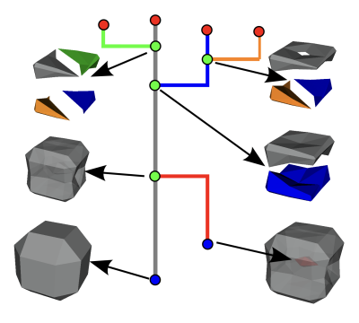
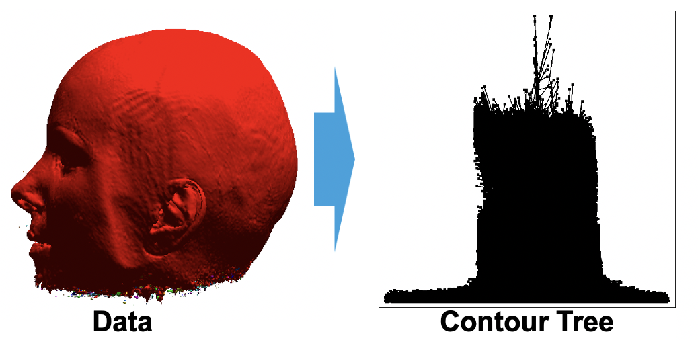
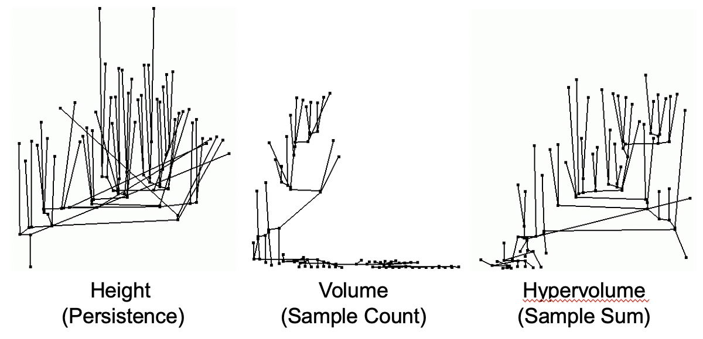

.. _label_topology:

Topological Analysis
====================

Overview
^^^^^^^^
Isosurfaces often have a useful interpretation in the application domain making
them an ubiquitous visual and data analysis technique, such as finding the
molecular boundaries in chemical simulations. Topological analysis identifies
relevant isosurfaces in data, and the contour tree summarizes the change in
isocontours as isovalue changes, with individual connected isosurface
components. Both of these techniques enable automatic data selection based on
finding relevant contours. Furthermore, contour tree simplification can
identify the most relevant topological features, thereby facilitating automatic
data reduction by focusing analysis on the most important contours.

Background
^^^^^^^^^^
The following section provides background information on the contour tree,
simplifying the contour tree and its use in selecting relevant contours. While
it is useful to understand this background, it is not strictly required to use
contour tree based isovalue selection and you may skip to `Getting Started`_ if
you are not interested in this background.

Contour Trees
-------------
Given a function from the simulation domain to a range of scalar values, a
common way to visualize that function is to pick an *isovalue* and  extract
*isoliness* (2D) or *isosurfaces* (3D), i.e., lines/surfaces that connect all
locations in space where the function assumes the isovalue. When considering
isolines/isosurfaces, one property often of particular interest is how many
connected components comprise the isocontour/isosurface. The *contour tree*,
described in the following, provides this information for all scalar values in
the range. To make this description more succinct, we use the term *contour* to
refer to a single connected component of the isosurface.

.. _ctfig:

   Example of a contour tree for a simple 3D toy data set to illustrate concepts.

:numref:`ctfig` shows the contour tree for a simple toy data set to illustrate
concepts. Consider the evolution of the contours shown in the figure. As the
isovalue increases, first the gay contour and later the red contour appear and
subsequently merge into a single contour (colored gray in the image). For a
higher isovalue, this contour splits into two contours (colored gray and blue in
the image. Each of these contours splits a second time, the gray contour into
two contours colored gray and green in the image and the blue contour into two
contours colored blue and orange in the figure. Finally, all contours disappear
at slightly different values.

The contour tree tracks this evolution of contours. Common graph layouts of
the contour tree choose node height (y-coordinate) to correspond to the isovalue
at which the corresponding event occurs. In the image, all edges in the contour
tree share the color of the contours they represent. Degree one nodes correspond
to appearing and disappearing contours and degree three (or higher) nodes
correspond to contours merging or splitting. We note that the contour tree does
not only encode how many contours exist for a given isovalue, but also their
relationship to each other, i.e., it encodes the identify of which contours are
involved in a merge or split event.

Contour Tree Simplification
---------------------------
.. _unsimplifiedctfig:

   Despite describing high-level isosurface behavior, contour trees can quickly
   become very complex.

Despite providing a high-level summary over isosurface behavior, the contour
tree can quickly become very complex, even for simple data sets, as shown in
:numref:`unsimplifiedctfig`. However, since the contour tree defines a
relationship between contours, it is possible to further simplify and reduce it
to the most relevant contours.

.. _simplifiedctfig:

   The contour tree from :numref:`unsimplifiedctfig` can be simplified using
   various simplification metrics.

:numref:`simplifiedctfig` shows the contour tree from
:numref:`unsimplifiedctfig` using various *simplification metrics*. A
simplification metric is a means to rank the importance of individual contours
and "prune" away unimportant branches of the contour tree. Three common choices
for the simplification metric are *persistence*, *volume* and *hypervolume*.
*Persistence* is the height of a branch in the contour tree, corresponding to
how long this contour lives as a distinct entity as the isovalue is changed.
*Volume* corresponds to contour volume, approximated as the number of mesh
points it comprises (for a regular, rectilinear grid) and *hypervolume*
corresponds to the integrated value of the scalar variable inside a contour,
approximated as the Riemann sum. Based on these simplification metrics it is
possible to rank all leaf branches in the contour tree and simplify it. At each
node we compare the "weights" of the two branches leading to it and "prune" the
the branch with the lower weight. For example, if we consider persistence in the
contour tree of numref:`ctfig`, branches would be pruned in the order green,
orange, red. Two types of simplification are common: (i) simplify until all
remaining branches have a weight above a given threshold or (ii) simplify until
only a specified number of "most important" branches remain.

Isovalue Selection
------------------
Our current approach for selecting the *n* most important isovalues proceeds as
follows. We simplify the contour tree down to the *n+1* most important
branches.  Subsequently, we pick a value that is one :math:`\epsilon` away from
the value at the branch point. This ensures that the contour has the maximum
possible size.  Please note that we select the most relevant contours and then
use their isovalue to extract an entire isosurface and not just the contour. We
are currently working on a filter that will extract just the relevant contours.

Getting Started
^^^^^^^^^^^^^^^
Contour tree-based isosurface selection is available via Ascen. However,
currently Ascent needs to be built with special options (enabling building vtk-m
with MPI support) to enable this capability. To build Ascent with contour tree
support, follow the instructions for `building Ascent via uberenv
<https://ascent.readthedocs.io/en/latest/BuildingAscent.html#building-with-uberenv>`_
but ensure that vtk-m is built with MPI support by adding ``--spec="%gcc
^vtkm+mpi"`` to the invocation on ``uberenv.py``, e.g., to build for Linux:

.. code-block:: console

  python scripts/uberenv/uberenv.py --prefix uberenv_libs \
                                    --spec="%gcc ^vtkm+mpi"

When Ascent is built with MPI support, contour tree-based isosurface selection
is available through Ascent's ``contour`` filter. Use the ``levels`` parameter
to select the desired number of isosurface levels and set the parameter
``use_contour_tree`` to ``true`` to enable isovalue selection via contour tree
(instead of using equidistant isovalues. (*Note*: Currently the parameters for
contour selection are hard-coded and use volume-based simplification for single
compute node runs and persistence-based simplification for MPI runs. We are
working on making isovalue selection more customizable and are looking for
collaborators using this method to help us identify useful parametrizations and
parameter choices. Furthermore, our current approach may result in one isovalue
being chosen multiple times, e.g., for highly symmetric datasets. Thus, the
resulting isosurface will be extracted for up to ``levels`` isovalues, but
possibly for fewer. We are working on resolving this issue.)

Use Case Examples
^^^^^^^^^^^^^^^^^

The following use case examples plots the scalar variable named ``Ex`` using
equidistant 15 isovalues and saves the results as ``levels_tttt.png`` (with
``tttt`` being the time step) and using 15 isovalues selected based on the contour tree
and saves the result as ``smart_ttt.png``.

.. code-block:: json

   [
     {
       "action": "add_pipelines",
       "pipelines":
       {
         "p1":
         {
           "f1":
           {
             "type" : "contour",
             "params" :
             {
               "field" : "Ex",
               "levels": 15
             }
           }
         },
         "p2":
         {
           "f1":
           {
             "type" : "contour",
             "params" :
             {
               "field" : "Ex",
               "levels": 15,
               "use_contour_tree": "true"
             }
           }
         }
       }
     },
     {
       "action": "add_scenes",
       "scenes":
       {
         "s1":
         {
           "image_prefix": "levels_%04d",
           "plots":
           {
             "p1":
             {
               "type": "pseudocolor",
               "pipeline": "p1",
               "field": "Ex"
             }
           }
         },
         "s2":
         {
           "image_prefix": "smart_%04d",
           "plots":
           {
             "p1":
             {
               "type": "pseudocolor",
               "pipeline": "p2",
               "field": "Ex"
             }
           }
         }
       }
     },
   ]

Performance
^^^^^^^^^^^
To improve the performance of contour tree calculation can use multithreading
on compute nodes or accelerators such as GPUs (via vtk-m). We are working on
making this functionality more easily accesible on machines like Summit.

Developers
^^^^^^^^^^
* David Camp (LBNL)
* Hamish Carr (University of Leeds)
* Oliver Rübel (LBNL)
* Gunther H. Weber (LBNL)

.. toctree::
   :maxdepth: 1
